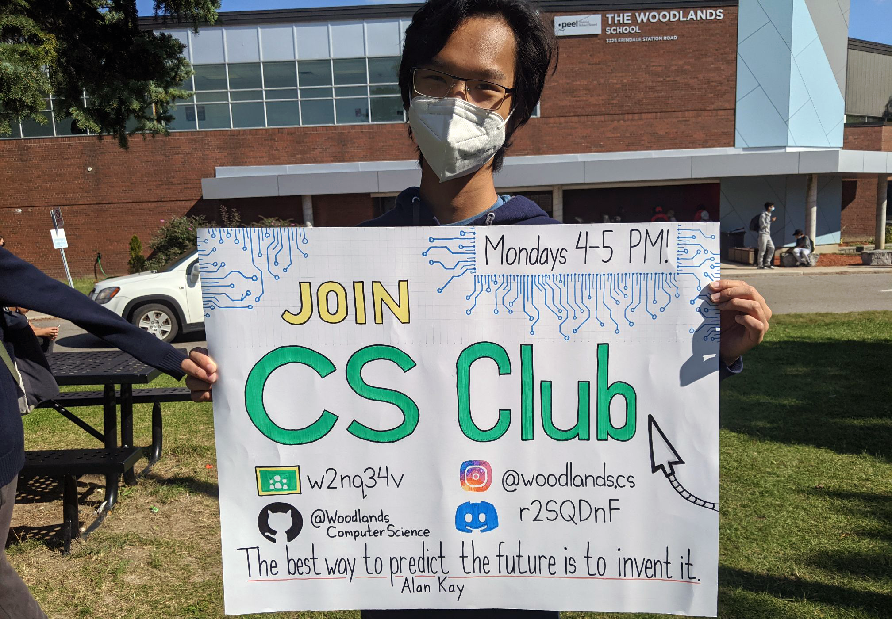

<h2 style="font-family: Merriweather; font-weight: lighter;">Welcome to The Woodlands Computer Science Club!</h2>

This is the official website for the Computer Science Club at The Woodlands School in Mississauga, Ontario. While this website is currently inactive, I (Max Liu) have been [maintaining it as a personal project](https://github.com/maxliu42/woodlandscodesnew/tree/main){:target="_blank"}.

A variety of topics awere covered, include competitive programming, software development, and web development.

Our club was structured into two groups, **Group A** and **Group B**.
Group A focused on teaching algorithms and competitive programming techniques, specifically for Waterloo's CCC held every February.
Group B focused on software development, having completed and showcased projects including Discord bots, games, and websites. Check out the
[Categories](categories.html){:target="_blank"} and [Tags](tags.html){:target="_blank"} for the content you want to see. 

Thanks for visiting our website!

